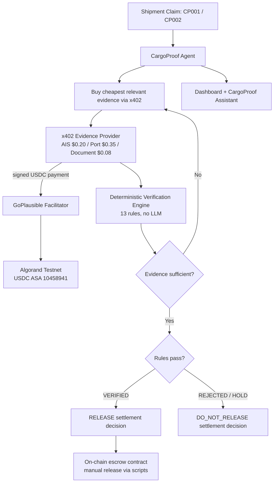

# CargoProof

**Pay for Evidence. Verify the Claim. Settle with Proof.**

Agent-native cargo verification: an agent buys independent evidence per-shipment through x402 micropayments on Algorand Testnet, and a deterministic rule engine decides VERIFIED/HOLD/REJECTED. The decision produces a RELEASE/HOLD **settlement outcome**, with on-chain escrow release available through the deployed contract and scripts.

**Facilitator:** [GoPlausible](https://facilitator.goplausible.xyz) · **Network:** Algorand Testnet · **Asset:** USDC ASA `10458941`

---

## The problem

A claim like *"MV Chennai Star arrived at Dubai Port on schedule"* can be internally consistent on paper while the underlying event is unverifiable. Trade-finance and cargo-insurance payouts are often released on self-reported claims because independent verification data has historically been sold as broad, standing data feeds rather than something you can buy per-claim.

## The answer

x402 makes per-claim verification economical: buy exactly the evidence a claim needs instead of paying for an entire data feed when only one claim needs verification. CargoProof's agent buys the cheapest evidence first and only escalates to more expensive evidence when the cheaper evidence is ambiguous — then a **deterministic, rule-based engine** (not an LLM) decides the outcome.

**Architecture principle:** AI proposes and explains. Evidence proves. Rules decide. Blockchain records the payment.

## Why CargoProof?

How CargoProof differs from common approaches:

| Traditional approach | CargoProof |
|---|---|
| Review documents | Purchase independent evidence |
| Pay for broad data feeds | Pay per evidence request |
| AI-generated judgment | Deterministic verification |
| Verification separated from settlement | Verification produces a settlement decision |
| Human/API-driven workflow | Agent-native evidence procurement |

---

## 30-second demo

```
1. Start 3 services (below)
2. Open the dashboard, click CP001 (Clean)
   → AIS/document evidence purchased via real x402 flow → VERIFIED → RELEASE settlement decision
3. Click CP002 (Fraud)
   → AIS evidence contradicts the claim → agent escalates to port evidence → REJECTED → HOLD settlement decision
4. Open the CargoProof Assistant panel, type "Verify CP001" or "Explain transaction <txid>"
```

---

## Architecture



The Node backend both *hosts* the x402-protected evidence endpoints and *pays* them via `paidFetch` — this repo demonstrates both sides of the x402 exchange in one process, for demo clarity.

---

## Services and ports

| Service | Port | Role |
|---|---:|---|
| CargoProof backend (`server/index.ts`) | **4021** | Agent orchestration, x402 client + resource server, chat API, dashboard state |
| Verification Engine (`verification_engine_service`) | **8001** | Deterministic rule evaluation (FastAPI) |
| Simulated Evidence API (`simulated_evidence`) | **8000** | Shipment/vessel/container/GPS/inspection/document data (FastAPI + SQLite) |
| Frontend (`npm run frontend`) | **5173** | Dashboard + CargoProof Assistant (static) |

The verification engine calls the evidence API at `EVIDENCE_API_URL` (default `http://127.0.0.1:8000`); the backend calls the verification engine at `VERIFICATION_ENGINE_URL` (default `http://127.0.0.1:8001`). Both are configurable in `.env`.

---

## Verification engine

13 deterministic rules (`verification_engine_service/verification_engine/rules.py`), each with a severity:

| Rule | Severity |
|---|---|
| SHIPMENT_EXISTS, VESSEL_EXISTS, CONTAINER_EXISTS, VESSEL_CONTAINER_MATCH, DESTINATION_MATCH, VESSEL_STATUS | CRITICAL |
| ORIGIN_MATCH, PORT_EVENT_CONSISTENCY, GPS_CONSISTENCY, DOCUMENT_CONSISTENCY, INSPECTION (failure case) | HIGH |
| CARGO_CONSISTENCY, INSPECTION (pass/unavailable) | MEDIUM |
| DATA_FRESHNESS | LOW |

Confidence starts at 100 and loses points per failed rule (CRITICAL −40, HIGH −25, MEDIUM −10, LOW −5). Decision logic: any CRITICAL failure → **REJECTED**; any remaining HIGH/MEDIUM failure → **HOLD**; otherwise → **VERIFIED**. VERIFIED maps to decision `RELEASE`; HOLD/REJECTED map to `DO_NOT_RELEASE`. Every report includes a SHA-256 `evidence_hash` of the collected evidence. This engine has **no LLM and no blockchain access** — it's a pure FastAPI service, verified by 48 passing pytest tests (`cd verification_engine_service && python -m pytest`).

---

## x402 payment flow (real, not mocked)

`server/index.ts` wires the actual SDKs end-to-end:

- **Challenge:** `/providers/ais/query`, `/providers/port/query`, `/providers/document/query` are wrapped in `paymentMiddleware` (`@x402/hono`) with real per-route USDC pricing ($0.20 / $0.35 / $0.08) and the live [GoPlausible](https://facilitator.goplausible.xyz) facilitator (`HTTPFacilitatorClient` from `@x402/core/server`).
- **Sign:** `ExactAvmScheme` (`@x402/avm/exact/client`) signs the USDC transfer using an Algorand keypair.
- **Retry:** `wrapFetchWithPayment` (`@x402/fetch`) automatically retries the original request with the signed payment attached.
- **Settle + receipt:** the facilitator settles on Algorand Testnet; the response's `PAYMENT-RESPONSE` header carries the transaction, which is stored against the evidence record and shown in the dashboard/assistant with a Lora Testnet link.

**`DEMO_MODE`** (`.env`, default `true`) swaps `paidFetch` for plain `fetch` and skips `paymentMiddleware`, so the pipeline runs without needing funded Testnet accounts. Set `DEMO_MODE=false` (and `PAY_TO`, `AVM_PRIVATE_KEY_BASE64`) to exercise real signed payments — the same code path runs either way.

The evidence provider responses themselves (`/providers/*/query` handlers) are **simulated**: hardcoded strings per scenario (`clean` / `fraud`), explicitly marked `simulated: true` in every response. The payment mechanics around them are real; the underlying AIS/port data is not.

**Stack:** `@x402/core`, `@x402/hono`, `@x402/fetch`, `@x402/avm`.

---

## Algorand escrow

`contracts/cargoproof_escrow.py` is a real PyTeal application: it holds USDC, records a verifier-submitted `evidence_hash`, and exposes `evidence` / `hold` / `release` app calls, with `release` performing an inner `AssetTransfer` to the beneficiary only when status is `VERIFIED`. Standalone scripts (`scripts/deploy.py`, `fund_escrow.py`, `deposit.py`, `release.py`, `optin_*.py`) can compile, deploy, fund, and release this contract on Testnet using `algosdk`.

**This contract is not called automatically by the demo pipeline.** `POST /api/reset` sets an in-memory `escrow: "RELEASED" | "HELD"` field based on the verification engine's `decision` — it does not submit an on-chain `release`/`hold` transaction. Running the actual escrow lifecycle on-chain requires running the scripts above manually against a deployed app.

> **Current MVP produces the settlement decision; automatic on-chain escrow release from that decision is a manual/future step**, not something `/api/reset` performs.

---

## CargoProof Assistant

A chat layer (`server/services/chatApi.ts`, `POST /api/v1/chat`) over the existing backend, exposed as a panel in the dashboard (`frontend/assistant.js`).

- Intent detection is **deterministic regex**, not LLM-driven: shipment IDs, Algorand transaction IDs, and keywords route to fixed handlers.
- **"Verify CP001" / "Explain CP002"** call the real `/api/reset` pipeline described above — same x402 payments, same verification engine.
- **Transaction lookups** ("Explain transaction \<id\>") validate the ID format (52-char base32) and query the real Algorand Indexer/Algod, returning a Lora Testnet link — invalid IDs get a clean error, not a fabricated answer.
- An LLM (Gemini or Groq, chosen via `AI_PROVIDER`) only phrases the structured result returned by the tools above; if no key is configured or the call fails, a deterministic templated response is used instead — the assistant never invents shipment, payment, or transaction facts.

**Known limitation:** plain shipment-detail lookups without "verify" (e.g. "Show me CP001") read from a separate seed file (`data/evidence-store.json`, IDs `CP-CLEAN`/`CP-FRAUD`) via `server/services/evidenceApi.ts`, which is **not** the same dataset the real verification pipeline uses (`simulated_evidence`'s SQLite store, IDs `CP001`–`CP010`). Details returned by a plain lookup (vessel name, route) may not match what the dashboard/verify flow shows for the same ID. Verify/evidence/payment/escrow questions are unaffected — they trigger `/api/reset` and read real pipeline state.

---

## Demo shipments

| Shipment | Scenario | AIS evidence | Escalation | Verification | Settlement decision |
|---|---|---|---|---|---|
| CP001 | Clean | Vessel docked, arrival confirmed | Buys cheap document check ($0.08) | VERIFIED | RELEASE |
| CP002 | Fraud | Vessel offshore, no port entry | Escalates to port evidence ($0.35) | REJECTED | HOLD |

(`simulated_evidence` also seeds CP003–CP010 covering other individual rule failures — vessel mismatch, missing container, GPS conflict, etc. — reachable via the verification engine's `/api/v1/verify` directly, but not wired into the dashboard's two scenario buttons.)

---

## Quick start

**Terminal 1 — evidence API**
```bash
python -m venv .venv && source .venv/bin/activate    # Windows: .venv\Scripts\Activate.ps1
pip install -r simulated_evidence/requirements.txt sqlalchemy
python -m simulated_evidence.seed
uvicorn simulated_evidence.main:app --port 8000
```

**Terminal 2 — verification engine**
```bash
source .venv/bin/activate
pip install -r verification_engine_service/requirements.txt
cd verification_engine_service && uvicorn verification_engine.main:app --port 8001
```

**Terminal 3 — backend**
```bash
npm install
cp .env.example .env   # fill in only what you need; DEMO_MODE=true needs nothing else
npm run server          # tsx server/index.ts, port 4021
```

**Terminal 4 — frontend**
```bash
npm run frontend         # npx serve frontend -l 5173
```

Open `http://localhost:5173`.

### Testing
```bash
npm run build                                      # tsc --noEmit
cd verification_engine_service && python -m pytest   # 48 tests, verified passing
```

---

## Environment variables (`.env.example`)

| Variable | Required | Purpose |
|---|---|---|
| `PORT` | no (default 4021) | Backend port |
| `DEMO_MODE` | no (default true) | `false` enables real signed x402 payments |
| `FACILITATOR_URL` | no | Defaults to GoPlausible facilitator |
| `PAY_TO` | only if `DEMO_MODE=false` | Address x402 payments settle to |
| `AVM_MNEMONIC` / `AVM_PRIVATE_KEY_BASE64` | only for real payments/escrow scripts | **Secret** — Algorand signer |
| `VERIFIER_ADDRESS`, `ESCROW_APP_ID`, `USDC_ASSET_ID` | only for escrow scripts | Escrow contract config |
| `VERIFICATION_ENGINE_URL`, `EVIDENCE_API_URL` | no | Override default localhost ports |
| `AI_PROVIDER`, `GEMINI_API_KEY`, `GROQ_API_KEY` | no | CargoProof Assistant LLM phrasing layer |
| `ALGOD_URL`, `INDEXER_URL` | no | Default to public Algonode Testnet endpoints |

> **Never commit `.env`, `AVM_MNEMONIC`, private keys, or API keys.** Use `.env.example` as the template only, with placeholder values.

---

## Current MVP scope

**Working:** x402 challenge→sign→retry→settle→receipt via real SDKs against the live GoPlausible facilitator; deterministic 13-rule verification engine (48 passing tests); Lora-linked transaction receipts; chat-triggered verification and real Algorand transaction lookup.

**Simulated:** AIS/port/document provider *content* (hardcoded per-scenario strings, explicitly flagged `simulated: true`); `simulated_evidence`'s shipment/vessel/GPS data (seeded SQLite, not live feeds).

**Partial:** On-chain escrow release/hold (contract + scripts exist and work standalone, but aren't triggered automatically by `/api/reset`); CargoProof Assistant's plain shipment-detail lookups (separate demo dataset from the real verify pipeline, noted above).

**Future:** Automatic on-chain escrow release wired into `/api/reset`; a real evidence-provider marketplace; reconciling the two evidence datasets into one.

---

## Tech stack

Node.js/TypeScript, Hono · Python/FastAPI (verification engine + evidence API) · SQLAlchemy/SQLite · PyTeal (escrow contract) · `@x402/core`, `@x402/hono`, `@x402/fetch`, `@x402/avm` · Algorand Testnet, `algosdk` · Vanilla JS dashboard · Gemini/Groq (assistant phrasing only)

---

**Don't trust the claim. Buy the evidence. Verify the evidence. Then move the money.**
